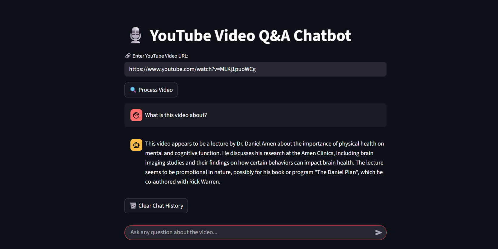

# 🎬 YouTube Video QnA System

**YouTube Video QnA System** is a Retrieval-Augmented Generation (RAG) chatbot that lets you paste in a YouTube video link and ask natural-language questions about it. It pulls the video's transcript, indexes it locally, and answers your questions using only what's actually said in the video — no rewatching, no scrubbing.

Everything runs **locally**: transcripts are embedded with a local HuggingFace sentence-transformer and answered by a local **Ollama** LLM, so no external LLM API key is required.

This solution is built for anyone who wants to pull knowledge out of long-form video content — lectures, talks, interviews, tutorials — without watching the whole thing.

---

## 🚨 Why Transcript?

Long-form video is one of the richest sources of information online — and one of the hardest to search.

### Core Challenges:
- **No Easy Search Inside Video**: You can't Ctrl+F your way through a video.
- **Time-Consuming to Rewatch**: Finding one answer often means scrubbing through minutes (or hours) of footage.
- **Context Gets Lost**: Skimming raw transcripts loses the thread of what's actually being explained.

---

## ✅ How Transcript Solves This

- 🔗 **Just Paste a Link**: Drop in any YouTube URL (`youtube.com/watch?v=...`, `youtu.be/...`, `/embed/...`, `/shorts/...`) — no downloads required.
- 📝 **Automatic Transcript Retrieval**: Fetches the video's English transcript via `youtube-transcript-api`.
- 🧠 **Local RAG Pipeline**: Splits and embeds the transcript, stores it in a FAISS vector index, and retrieves the most relevant chunks for each question.
- 🤖 **Runs on a Local LLM**: Answers are generated by a local Ollama model (default `llama3.1:8b`) — nothing leaves your machine.
- 💬 **Conversational, Session-Based**: Each processed video gets its own session, so you can ask follow-up questions without reprocessing.

---

## 📸 Screenshot



--- 

## 🛠️ Tech Stack

### 🌐 Frontend
- **React** – UI components
- **Vite** – Lightning-fast dev/build tool
- **Tailwind CSS** – Utility-first styling
- **Axios** – API requests to the backend

### 🔗 Backend
- **FastAPI** – Python web framework (APIs)
- **LangChain** – RAG pipeline orchestration
- **Ollama** – Local LLM for answer generation
- **FAISS** – Vector similarity search
- **youtube-transcript-api** – Transcript extraction from YouTube
<!-- - **Tenacity** – Retry logic for robust operations   -->

---

## 🏗️ RAG Pipeline

Transcript's strength = a **local, session-based RAG pipeline**.
Each video is processed once, then queried through a lightweight in-memory session.

- **Video ID Extractor** → Parses the YouTube URL (standard, short, embed, or Shorts links) into a video ID.
- **Transcript Fetcher** → Pulls the English transcript via `YouTubeTranscriptApi`.
- **Text Splitter** → Breaks the transcript into overlapping chunks with `RecursiveCharacterTextSplitter`.
- **Embedding & Vector Store** → Embeds chunks locally and indexes them in **FAISS**.
- **RetrievalQA Chain** → Retrieves the top relevant chunks and passes them to a local **Ollama** LLM to generate a grounded answer.
- **Session Manager** → Manages workflow, passes data, handles errors.

---

## 📡 API Reference

### ▶️ Process a Video
**POST** `/api/process-video`
Fetches the transcript, builds the RAG pipeline, and creates a new session.

#### Request Body:
```json
{
  "video_url": "https://www.youtube.com/watch?v=dQw4w9WgXcQ"
}
```

#### Responses:
- `200 OK` → Returns `session_id`, `video_id`, and a success message
- `400 Bad Request` → Missing/invalid `video_url`, or transcript unavailable
- `500 Internal Server Error` → Processing failure (error message in JSON)

---

### ▶️ Ask a Question
**POST** `/api/ask`
Answers a question about a previously processed video.

#### Request Body:
```json
{
  "session_id": "YOUR_SESSION_ID",
  "question": "What is the main topic discussed in this video?"
}
```

#### Responses:
- `200 OK` → Returns `answer` and `session_id`
- `404 Not Found` → Unknown/expired session
- `500 Internal Server Error` → LLM/chain failure (error message in JSON)

---

## 🧪 Getting Started

### 📦 Prerequisites
- Python **3.10+**
- Node.js **v18+** (with npm)
- [Ollama](https://ollama.com) installed and running locally, with a model pulled:
  ```bash
  ollama pull llama3.1:8b
  ```

---

### 🚀 Installation

**Clone the Repo**
```bash
git clone https://github.com/amitjadhav93/YouTube-Video-QnA-System.git
cd YouTube-Video-QnA-System
```

**Backend Setup**
```bash
cd backend
pip install -r requirements.txt
```

**Frontend Setup**
```bash
cd ../frontend
npm install
```

---

### 🔐 Environment Variables

Create **`backend/.env`**:
```env
# Ollama server URL and model
OLLAMA_BASE_URL=http://localhost:11434
OLLAMA_MODEL=llama3.1:8b

# HuggingFace embedding model used for transcript chunks
EMBEDDING_MODEL=sentence-transformers/all-MiniLM-L6-v2

# Comma-separated list of allowed CORS origins
ALLOWED_ORIGINS=http://localhost:5173,http://localhost:3000
```

Create **`frontend/.env`**:
```env
VITE_API_BASE_URL=http://localhost:8000
```

---

### 🧑‍💻 Running the Application

**Start Backend (FastAPI)**
```bash
cd backend
uvicorn main:app --reload --port 8000
```

**Start Frontend (Vite)**
```bash
cd frontend
npm run dev
```

App will be available at → [http://localhost:5173](http://localhost:5173)

---

## 🌱 Future Scope
- 🗄️ **Persistent, Shared Sessions** – Move from the in-memory store to Redis or a DB-backed vector store
- ⏳ **Session Expiry** – Automatically clean up sessions older than N hours
- 🔗 **Timestamp Linking** – Jump straight to the moment an answer comes from
- 🌍 **Multi-Language Support** – Support videos without an English transcript
- 🔄 **Streaming Answers** – Stream LLM responses token-by-token instead of waiting for the full answer 
